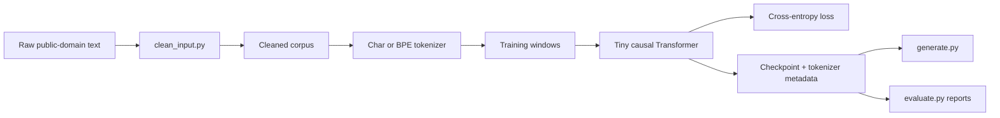

# Tiny LLM From Scratch

This project is a small character-level language model. It started as a bigram
model that predicted the next character from only the current character, and now
uses a stacked tiny Transformer that can look at a short window of previous
characters.
The Transformer includes dropout to reduce memorization on small datasets.

## Status

Educational machine-learning systems project. The goal is not to build a useful
chatbot; it is to implement the core pieces of a GPT-style language model in a
small, inspectable PyTorch codebase.

## What It Demonstrates

- Bigram baseline for next-token prediction
- Causal Transformer language model with residual blocks and self-attention
- Character tokenization and byte-level BPE tokenization
- Train/validation splits and best-checkpoint saving
- Resume training with checkpoint architecture/tokenizer metadata
- Temperature, top-k, and top-p sampling
- Repeatable evaluation reports with fixed prompts
- Apple Silicon MPS support through PyTorch

## Architecture



## Current Model Shape

| Setting | Default |
| --- | ---: |
| Context length | `128` tokens |
| Embedding dim | `128` |
| Attention heads | `4` |
| Transformer layers | `3` |
| Dropout | `0.1` |
| Optimizer | `AdamW` |
| Learning-rate schedule | cosine decay |

## Results Snapshot

Evaluation reports are written to `runs/` when using `evaluate.py --save`.
Representative Sherlock BPE runs reached validation loss in the high `3.x`
range and produced locally coherent Doyle-like phrasing, while still showing
the expected limitations of a small model: weak long-range plot logic and
occasional invented words.

Generated samples are a better comparison across tokenizers than raw loss
because character and BPE models predict different units.

## Project Layout

```text
tiny-llm/
  data/
    source/          # raw text files
    cleaned/         # cleaned model-ready text files
  scripts/
    clean_input.py   # raw text cleanup
  tokenization.py    # char and BPE tokenizer adapters
  model.py           # model definitions
  train.py           # training loop
  generate.py        # text generation from a saved checkpoint
  evaluate.py        # repeatable checkpoint evaluation reports
  requirements.txt   # Python dependencies
```

## Setup

```bash
python3 -m venv .venv
source .venv/bin/activate
pip install -r requirements.txt
```

## Train

```bash
python scripts/clean_input.py
python train.py
```

By default, `clean_input.py` cleans every `.txt` file in `data/source/` and
writes matching cleaned files to `data/cleaned/`.

By default, `train.py` reads every `.txt` file in `data/cleaned/`. You can also
train on one cleaned file or a different folder:

```bash
python train.py --data data/cleaned/input.txt
python train.py --data data/cleaned
```

Character tokenization is the default baseline. To train a Byte-Level BPE
tokenizer on the same cleaned text and use it for model training:

```bash
python train.py --data data/cleaned/sherlock --tokenizer bpe --vocab-size 2000
```

To continue training from the best checkpoint, use `--resume`. `--max-iters`
means additional optimizer steps to run in this invocation:

```bash
python train.py --data data/cleaned/sherlock --resume checkpoints/tiny_transformer_best.pt --max-iters 24000
```

By default, training now uses cosine learning-rate decay from `1e-3` to `1e-4`
over the current run. To make the schedule explicit:

```bash
python train.py --data data/cleaned/sherlock \
  --resume checkpoints/tiny_transformer_best.pt \
  --max-iters 8000 \
  --learning-rate 1e-3 \
  --min-learning-rate 1e-4 \
  --lr-decay cosine
```

Training prints periodic train/validation loss values so you can see whether the
model is improving over time.
Generated samples use temperature, top-k, and top-p sampling to make output less
controlled than greedy decoding but less chaotic than sampling from every
possible character.
The default training config uses a 3-block Transformer with a 128-character
context window.
On Apple Silicon, the scripts use PyTorch's MPS accelerator when available:

```bash
python train.py --device mps
python generate.py "My dear Watson" --device mps
```

`mps` means the integrated Apple Silicon GPU through Metal Performance Shaders.
It does not mean the Apple Neural Engine. Standard PyTorch cannot directly run
this model on the Neural Engine with `model.to("ane")` or similar. For Neural
Engine deployment, train or prototype in PyTorch, then convert a supported,
fixed-shape inference graph to Core ML with `coremltools` and run the resulting
`.mlpackage` through Apple's Core ML runtime. For this learning repo, MPS is the
practical path for local training and generation on an M1/M2/M3 Mac.

For quick smoke tests, write checkpoints outside the default training files:

```bash
python train.py --device cpu --max-iters 1 \
  --checkpoint /tmp/tiny_transformer_smoke.pt \
  --best-checkpoint /tmp/tiny_transformer_smoke_best.pt
```

You can also change model size for a new training run without editing code:

```bash
python train.py --data data/cleaned/sherlock \
  --tokenizer bpe \
  --vocab-size 2000 \
  --context-length 128 \
  --num-layers 6 \
  --activation gelu \
  --tie-weights \
  --batch-size 16 \
  --checkpoint checkpoints/tiny_transformer_gelu_tied.pt \
  --best-checkpoint checkpoints/tiny_transformer_gelu_tied_best.pt
```

When using `--resume`, the checkpoint architecture wins and architecture flags
like `--context-length` are ignored. This prevents mismatching saved weights.

This writes a checkpoint to:

```text
checkpoints/tiny_transformer.pt
checkpoints/tiny_transformer_best.pt
```

The final checkpoint stores the model at the end of training. The best
checkpoint stores the model from the step with the lowest validation loss and is
used by `generate.py` by default.

## Generate

```bash
python generate.py
```

You can condition generation with a prompt and tune decoding:

```bash
python generate.py "The governess looked"
python generate.py "The old house" --temperature 0.75 --top-k 20 --top-p 0.95
python generate.py "Mrs. Grose said" --max-new-tokens 300
python generate.py "My dear Watson"
```

## Evaluate

Use `evaluate.py` to compare checkpoints with repeatable loss estimates and the
same prompt set:

```bash
python evaluate.py --data data/cleaned/sherlock --checkpoint checkpoints/tiny_transformer_best.pt --save
```

This prints a Markdown report and, with `--save`, writes it to `runs/`.

## Verification

Quick syntax check:

```bash
python3 -m py_compile devices.py model.py tokenization.py train.py generate.py evaluate.py scripts/clean_input.py
```

Quick training smoke test:

```bash
python train.py --device cpu --max-iters 1 \
  --checkpoint /tmp/tiny_transformer_smoke.pt \
  --best-checkpoint /tmp/tiny_transformer_smoke_best.pt
```

## Repository Hygiene

Large generated artifacts are intentionally excluded from version control:

- local virtual environments
- `__pycache__/`
- model checkpoints
- generated evaluation reports
- cleaned/generated training corpora when publishing a lightweight repo

Keep the public repository focused on code, docs, and reproducible commands.

## Build History

This project is meant to be learned in layers. Each step kept the code small
while adding one real language-modeling idea.

1. **Bigram baseline**

   Started with `BigramLanguageModel`, a learned lookup table that predicts the
   next character from only the current character.

   ```text
   current character -> next character
   ```

   What it taught: tensors, embeddings, logits, cross-entropy loss, and
   autoregressive generation.

2. **Validation loss**

   Added a train/validation split and periodic loss estimates.

   ```text
   train loss = how well the model fits examples it learns from
   val loss   = how well it predicts held-out text
   ```

   What it taught: overfitting, generalization, and why lower training loss
   alone does not mean the model is better.

3. **Tiny Transformer**

   Replaced the bigram-only path with `TinyTransformerLanguageModel`, adding
   token embeddings, position embeddings, causal self-attention, a feedforward
   MLP, LayerNorm, residual connections, and dropout.

   ```text
   recent character window -> attention over context -> next character
   ```

   What it taught: how GPT-style models use context instead of one-token lookup.

4. **Cleaner training text**

   Moved raw text cleanup into `scripts/clean_input.py`. Raw files live in
   `data/source/`; cleaned model-ready files live in `data/cleaned/`.

   What it taught: small models are sensitive to data distribution. More text is
   not automatically better if the text contains unrelated formats.

5. **Apple Silicon acceleration**

   Updated device selection to prefer CUDA, then Apple Silicon MPS, then CPU.

   ```text
   cuda -> mps -> cpu
   ```

   What it taught: Python orchestrates the training loop, but PyTorch runs the
   heavy tensor operations on optimized backends.

6. **Larger training config**

   Increased context length and batch coverage before changing architecture.

   ```text
   context length: 32 -> 64 -> 128
   batch coverage: batch_size * context_length
   ```

   What it taught: each batch contains many next-character prediction examples,
   and context length controls how far back the model can look.

7. **Stacked Transformer blocks**

   Refactored the model into reusable `TransformerBlock` layers and moved to a
   3-block, 128-dimensional model.

   ```text
   embedding -> block -> block -> block -> output
   ```

   What it taught: depth gives the model multiple rounds to read, mix, and
   refine context.

8. **Temperature, top-k, and top-p sampling**

   Added generation controls so sampling can be less repetitive than greedy
   decoding but less chaotic than sampling from every possible character.

   ```text
   logits -> temperature -> top-k/top-p filters -> softmax -> sample
   ```

   What it taught: model training and decoding strategy are separate parts of
   language generation.

9. **Prompted generation**

   Added command-line prompts so generation can start from user-provided text
   instead of always starting from an empty token.

   ```text
   prompt text -> encode chars -> model continues from prompt
   ```

   What it taught: autoregressive models generate continuations conditioned on
   the context you provide.

10. **Best validation checkpoint**

   Training now saves both the final model and the model with the lowest
   validation loss.

   ```text
   checkpoints/tiny_transformer.pt       # final training step
   checkpoints/tiny_transformer_best.pt  # best validation loss
   ```

   What it taught: the best model is often selected by validation performance,
   not by whichever weights happen to exist at the end of training.

11. **Byte-Level BPE tokenization**

   Added Hugging Face `tokenizers` support while keeping character tokenization
   as the default baseline.

   ```text
   characters -> bytes/subword chunks -> token IDs
   ```

   What it taught: modern language models usually predict text chunks rather
   than individual characters. This should improve spelling because common words
   and fragments can become single learned tokens.

12. **Checkpoint resume**

   Added `--resume` and `--max-iters` so longer training can continue from a
   saved checkpoint instead of starting over.

   ```text
   checkpoint -> restore model/tokenizer -> continue optimizer steps
   ```

   What it taught: training is iterative state. A checkpoint needs enough
   metadata to rebuild the tokenizer, architecture, model weights, and optimizer
   state for a clean continuation.

13. **Longer BPE training observations**

   Resumed the Sherlock BPE checkpoint and trained from step `7750` to around
   step `24000`. Validation improved from about `3.76` to a new best near
   `3.60`, and samples became more readable.

   ```text
   more steps -> better spelling/style -> slower, noisier validation gains
   ```

   What it taught: once the model is in the right neighborhood, validation loss
   can bounce around even while the long-term trend improves. The best checkpoint
   matters because the final step is not always the best model.

14. **Learning-rate decay**

   Added cosine learning-rate decay so training can start with larger updates
   and gradually shift toward smaller adjustments.

   ```text
   lr 1e-3 -> cosine decay -> lr 1e-4
   ```

   What it taught: after a model has learned the broad patterns, keeping the
   step size too high can make validation loss bounce around a good area. Decay
   is a simple way to keep learning while reducing that noise.

15. **Repeatable evaluation**

   Added `evaluate.py` so checkpoints can be compared with the same data split,
   deterministic random batches, parameter counts, and prompt samples.

   ```text
   checkpoint -> measured losses + samples -> runs/eval_*.md
   ```

   What it taught: ML progress needs repeatable measurements. A good sample is
   encouraging, but a saved evaluation report makes experiments comparable.

16. **Configurable architecture experiments**

   Added CLI knobs for batch size, context length, embedding width, heads,
   layers, and dropout.

   ```text
   baseline checkpoint -> evaluate -> train one architecture variant -> evaluate again
   ```

   What it taught: changing architecture should be an experiment, not a hidden
   code edit. Separate checkpoint paths keep results comparable and prevent
   overwriting the current best model.

17. **Deeper Transformer experiment**

   After the 256-context experiment proved slower and worse early on, the next
   architecture test is keeping context at `128` and increasing depth from `3`
   to `6` Transformer blocks.

   ```text
   3 blocks at ctx128 -> 6 blocks at ctx128
   ```

   What it teaches: extra layers give the model more rounds of attention and
   feedforward refinement without the quadratic cost jump of longer context.

18. **Current architecture findings**

   The `ctx256` experiment was much slower and worse early on, so longer context
   was shelved for now. The 6-layer `ctx128` model improved with a resume +
   decay run, reaching around `3.62` validation loss, close to but not clearly
   better than the 3-layer best near `3.60`.

   ```text
   ctx256: slower and worse
   layers6: promising, not champion yet
   ```

   What it taught: more capacity is not automatically better. Each architecture
   change needs its own training budget and evaluation report.

19. **GELU and weight tying**

   Added a more GPT-like feedforward activation and optional embedding/output
   weight tying. New runs default to `GELU` and tied weights; old checkpoints
   still load as `ReLU` and untied unless their metadata says otherwise.

   ```text
   ReLU MLP -> GELU MLP
   separate embedding/output tables -> tied token table
   ```

   What it teaches: quality can improve through small block-level design choices,
   not only by making the model deeper or wider.

## Model Visuals

The deeper model explanation lives in
[`docs/model-visuals.md`](docs/model-visuals.md). It has matrix-shaped views of
the tensors, Mermaid flowcharts for the full stack, and a breakdown of what
happens inside one Transformer block.

The tokenizer design lives in
[`docs/tokenization-design.md`](docs/tokenization-design.md). It compares
character tokenization with Byte-Level BPE and explains the checkpoint metadata
used by `train.py` and `generate.py`.

## Learning Path

1. Compare `BigramLanguageModel` and `TinyTransformerLanguageModel` in
   `model.py`.
2. Trace one batch through `get_batch`, `forward`, loss calculation, and
   generation.
3. Experiment with prompts, `TEMPERATURE`, `TOP_K`, and `TOP_P` in
   `generate.py`.
4. Add more raw text to `data/source/`, clean it, and inspect validation loss.
5. Compare character tokenization with Byte-Level BPE on the same corpus.
6. Use `evaluate.py --save` before and after architecture experiments.
