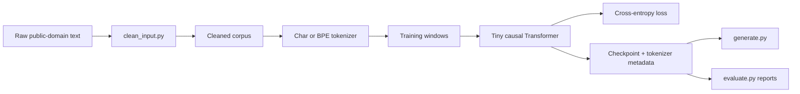

# Tiny LLM From Scratch

This project is a small next-token language model. It started as a
character-level bigram model that predicted the next character from only the
current character, and now uses a stacked tiny Transformer that can train with
either character tokens or Byte-Level BPE tokens.

## Status

Educational machine-learning systems project. The goal is not to build a useful
chatbot; it is to implement the core pieces of a GPT-style language model in a
small, inspectable PyTorch codebase.

## What It Demonstrates

- Bigram baseline for next-token prediction
- Causal Transformer language model with residual blocks and self-attention
- Character tokenization and byte-level BPE tokenization
- Train/validation splits and best-checkpoint saving
- Resume training with checkpoint architecture/tokenizer metadata
- Learning-rate decay and gradient clipping
- Temperature, top-k, and top-p sampling
- Repeatable evaluation reports with fixed prompts
- Apple Silicon MPS support through PyTorch

## Architecture



## Current Model Shape

| Setting | Default |
| --- | ---: |
| Context length | `128` tokens |
| Embedding dim | `128` |
| Attention heads | `4` |
| Transformer layers | `3` |
| Dropout | `0.1` |
| Optimizer | `AdamW` |
| Learning-rate schedule | cosine decay |
| Gradient clipping | max norm `1.0` |
| Fresh-run activation | `gelu` |
| Fresh-run output head | tied to token embeddings |

## Results Snapshot

Evaluation reports are written to `runs/` when using `evaluate.py --save`.
Representative Sherlock BPE runs reached validation loss in the mid `3.x`
range and produced locally coherent Doyle-like phrasing, while still showing
the expected limitations of a small model: weak long-range plot logic and
occasional invented words.

Generated samples are a better comparison across tokenizers than raw loss
because character and BPE models predict different units.
The running experiment log tracks which model variant is currently winning.

## Project Layout

```text
tiny-llm/
  data/
    source/          # raw text files
    cleaned/         # cleaned model-ready text files
  scripts/
    clean_input.py   # raw text cleanup
  tokenization.py    # char and BPE tokenizer adapters
  model.py           # model definitions
  train.py           # training loop
  generate.py        # text generation from a saved checkpoint
  evaluate.py        # repeatable checkpoint evaluation reports
  requirements.txt   # Python dependencies
```

## Setup

```bash
python3 -m venv .venv
source .venv/bin/activate
pip install -r requirements.txt
```

## Train

```bash
python scripts/clean_input.py
python train.py
```

By default, `clean_input.py` cleans every `.txt` file in `data/source/` and
writes matching cleaned files to `data/cleaned/`.

By default, `train.py` reads every `.txt` file in `data/cleaned/`. You can also
train on one cleaned file or a different folder:

```bash
python train.py --data data/cleaned/input.txt
python train.py --data data/cleaned
```

Character tokenization is the default baseline. To train a Byte-Level BPE
tokenizer on the same cleaned text and use it for model training:

```bash
python train.py --data data/cleaned/sherlock --tokenizer bpe --vocab-size 2000
```

To continue training from the best checkpoint, use `--resume`. `--max-iters`
means additional optimizer steps to run in this invocation:

```bash
python train.py --data data/cleaned/sherlock --resume checkpoints/tiny_transformer_best.pt --max-iters 24000
```

By default, training now uses cosine learning-rate decay from `1e-3` to `1e-4`
over the current run. To make the schedule explicit:

```bash
python train.py --data data/cleaned/sherlock \
  --resume checkpoints/tiny_transformer_best.pt \
  --max-iters 8000 \
  --learning-rate 1e-3 \
  --min-learning-rate 1e-4 \
  --lr-decay cosine \
  --grad-clip 1.0
```

Training prints periodic train/validation loss values so you can see whether the
model is improving over time.
Generated samples use temperature, top-k, and top-p sampling to make output less
controlled than greedy decoding but less chaotic than sampling from every
possible character.
The default training config uses a 3-block Transformer with a 128-character
context window.
On Apple Silicon, the scripts use PyTorch's MPS accelerator when available:

```bash
python train.py --device mps
python generate.py "My dear Watson" --device mps
```

`mps` means the integrated Apple Silicon GPU through Metal Performance Shaders.
It does not mean the Apple Neural Engine. Standard PyTorch cannot directly run
this model on the Neural Engine with `model.to("ane")` or similar. For Neural
Engine deployment, train or prototype in PyTorch, then convert a supported,
fixed-shape inference graph to Core ML with `coremltools` and run the resulting
`.mlpackage` through Apple's Core ML runtime. For this learning repo, MPS is the
practical path for local training and generation on an M1/M2/M3 Mac.

For quick smoke tests, write checkpoints outside the default training files:

```bash
python train.py --device cpu --max-iters 1 \
  --checkpoint /tmp/tiny_transformer_smoke.pt \
  --best-checkpoint /tmp/tiny_transformer_smoke_best.pt
```

You can also change model size for a new training run without editing code:

```bash
python train.py --data data/cleaned/sherlock \
  --tokenizer bpe \
  --vocab-size 2000 \
  --context-length 128 \
  --num-layers 6 \
  --activation gelu \
  --tie-weights \
  --batch-size 16 \
  --checkpoint checkpoints/tiny_transformer_gelu_tied.pt \
  --best-checkpoint checkpoints/tiny_transformer_gelu_tied_best.pt
```

When using `--resume`, the checkpoint architecture wins and architecture flags
like `--context-length` are ignored. This prevents mismatching saved weights.

This writes a checkpoint to:

```text
checkpoints/tiny_transformer.pt
checkpoints/tiny_transformer_best.pt
```

The final checkpoint stores the model at the end of training. The best
checkpoint stores the model from the step with the lowest validation loss and is
used by `generate.py` by default.

## Generate

```bash
python generate.py
```

You can condition generation with a prompt and tune decoding:

```bash
python generate.py "The governess looked"
python generate.py "The old house" --temperature 0.75 --top-k 20 --top-p 0.95
python generate.py "Mrs. Grose said" --max-new-tokens 300
python generate.py "My dear Watson"
```

## Evaluate

Use `evaluate.py` to compare checkpoints with repeatable loss estimates and the
same prompt set:

```bash
python evaluate.py --data data/cleaned/sherlock --checkpoint checkpoints/tiny_transformer_best.pt --save
```

This prints a Markdown report and, with `--save`, writes it to `runs/`.

## Verification

Quick syntax check:

```bash
python3 -m py_compile devices.py model.py tokenization.py train.py generate.py evaluate.py scripts/clean_input.py
```

Quick training smoke test:

```bash
python train.py --device cpu --max-iters 1 \
  --checkpoint /tmp/tiny_transformer_smoke.pt \
  --best-checkpoint /tmp/tiny_transformer_smoke_best.pt
```

## Repository Hygiene

Large generated artifacts are intentionally excluded from version control:

- local virtual environments
- `__pycache__/`
- model checkpoints
- generated evaluation reports
- cleaned/generated training corpora when publishing a lightweight repo

Keep the public repository focused on code, docs, and reproducible commands.

## Project Notes

The deeper model explanation lives in
[`docs/model-visuals.md`](docs/model-visuals.md). It has matrix-shaped views of
the tensors, Mermaid flowcharts for the full stack, and a breakdown of what
happens inside one Transformer block.

The tokenizer design lives in
[`docs/tokenization-design.md`](docs/tokenization-design.md). It compares
character tokenization with Byte-Level BPE and explains the checkpoint metadata
used by `train.py` and `generate.py`.

The research timeline and current experiment findings live in
[`docs/experiment-log.md`](docs/experiment-log.md). That file is the lab
notebook for validation-loss observations, architecture comparisons, and next
ablations.

## Learning Path

1. Compare `BigramLanguageModel` and `TinyTransformerLanguageModel` in
   `model.py`.
2. Trace one batch through `get_batch`, `forward`, loss calculation, and
   generation.
3. Experiment with prompts, `TEMPERATURE`, `TOP_K`, and `TOP_P` in
   `generate.py`.
4. Add more raw text to `data/source/`, clean it, and inspect validation loss.
5. Compare character tokenization with Byte-Level BPE on the same corpus.
6. Use `evaluate.py --save` before and after architecture experiments.
