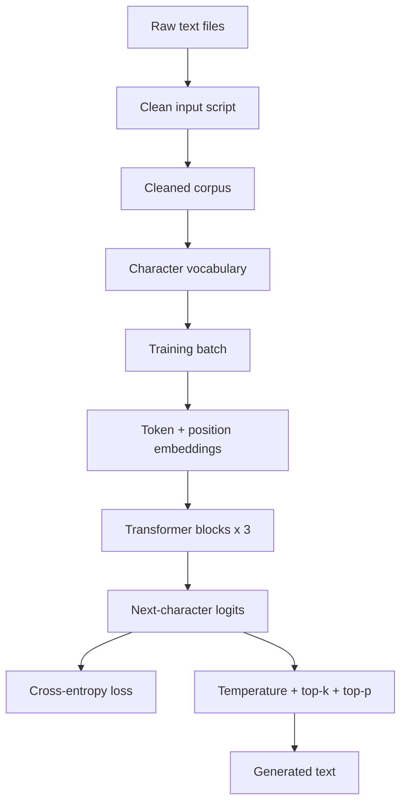
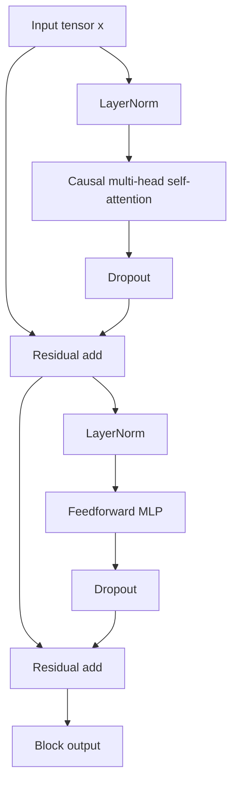
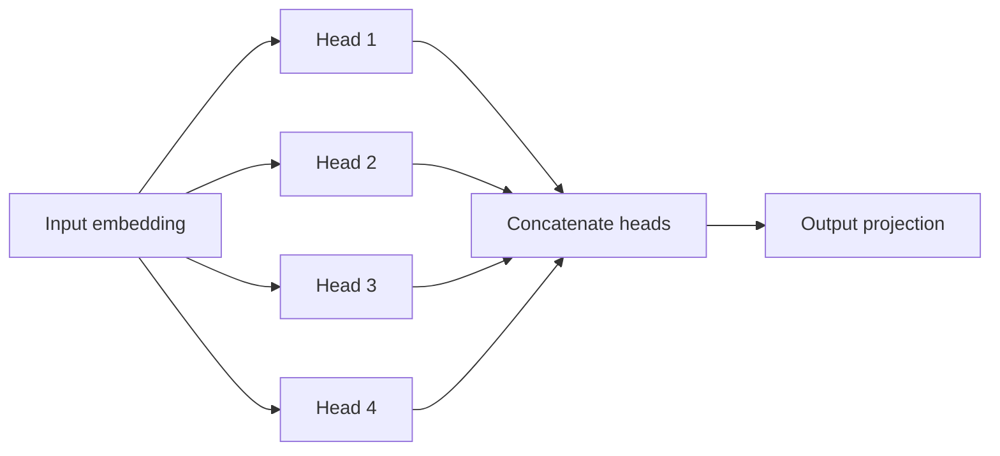
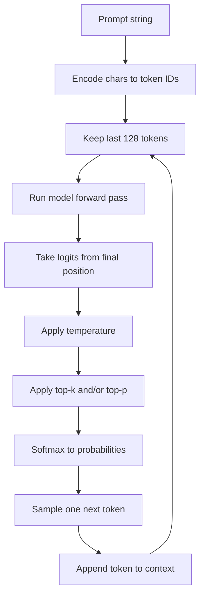

# Tiny Transformer Visual Guide

This file is the model map. The README stays focused on setup and commands;
this document is for building intuition about the full stack from raw text to
sampled output.

Most diagrams here are plain Markdown tables or Mermaid. They are readable in
Vim/Neovim as text, and Mermaid-capable preview tools can render the flowcharts.

## Current Model

| Part | Current value | Why it matters |
| --- | ---: | --- |
| Token type | Character | Smallest simple tokenizer; easy to understand |
| Vocabulary | Data-dependent | One row per unique character in the cleaned text |
| Batch size | 32 | Number of independent text windows per step |
| Context length | 128 | How many recent characters each prediction can see |
| Embedding dim | 128 | Width of each token's internal feature vector |
| Attention heads | 4 | Parallel ways to compare context positions |
| Transformer blocks | 3 | Repeated attention + MLP refinement layers |
| Dropout | 0.1 | Training-time noise to reduce memorization |

## Full Stack



## From Text To Integer Matrices

The model never sees strings directly. It sees integer IDs.

Example text:

```text
The old house
```

Example character vocabulary:

| Character | `T` | `h` | `e` | space | `o` | `l` | `d` | `u` | `s` |
| --- | ---: | ---: | ---: | ---: | ---: | ---: | ---: | ---: | ---: |
| Token id | 52 | 31 | 28 | 0 | 38 | 35 | 27 | 44 | 42 |

One training row is a sliding window. `idx` is the input, `targets` is the same
window shifted left by one character.

| Position | 0 | 1 | 2 | 3 | 4 | 5 | 6 | 7 |
| --- | ---: | ---: | ---: | ---: | ---: | ---: | ---: | ---: |
| `idx` chars | `T` | `h` | `e` | space | `o` | `l` | `d` | space |
| `target` chars | `h` | `e` | space | `o` | `l` | `d` | space | `h` |

With the current config, a full batch looks like this:

| Tensor | Shape | Software-engineer meaning |
| --- | --- | --- |
| `idx` | `[32, 128]` | 32 independent arrays of token IDs |
| `targets` | `[32, 128]` | 32 arrays of expected next token IDs |
| Training examples per step | `32 * 128 = 4096` | Each position contributes one next-char prediction |

## Embedding Tables

An embedding table is a learned array lookup.

| Token id | Feature 0 | Feature 1 | Feature 2 | ... | Feature 127 |
| ---: | ---: | ---: | ---: | ---: | ---: |
| 0 | 0.12 | -0.04 | 0.31 | ... | -0.18 |
| 1 | -0.07 | 0.22 | 0.09 | ... | 0.44 |
| 2 | 0.36 | -0.11 | -0.27 | ... | 0.05 |
| ... | ... | ... | ... | ... | ... |

Lookup turns `[batch, context]` integer IDs into dense vectors:

| Stage | Shape |
| --- | --- |
| Character IDs | `[32, 128]` |
| Token embeddings | `[32, 128, 128]` |
| Position embeddings | `[128, 128]` |
| Token + position state | `[32, 128, 128]` |

Position embeddings are added because attention sees a set of vectors. Without
position information, the model would know which characters exist, but not where
they occur in the context window.

## One Transformer Block



The important pattern:

| Sublayer | Mixes across positions? | Changes feature vectors? | Keeps same shape? |
| --- | --- | --- | --- |
| Self-attention | Yes | Yes | Yes |
| Feedforward MLP | No | Yes | Yes |
| Residual add | No | Adds update back to state | Yes |
| LayerNorm | No | Stabilizes each vector | Yes |

## Attention As Matrix Multiplication

Inside attention, each token vector is projected into three learned views:

| Name | Meaning | Shape per batch |
| --- | --- | --- |
| `Q` query | What this position is looking for | `[context, head_dim]` |
| `K` key | What this position offers to be matched against | `[context, head_dim]` |
| `V` value | Information copied when a key is attended to | `[context, head_dim]` |

Attention scores are pairwise comparisons:

```text
scores = Q @ K.T
```

For a tiny 5-token context, that creates a matrix like this:

| Reads from -> | pos 0 | pos 1 | pos 2 | pos 3 | pos 4 |
| --- | ---: | ---: | ---: | ---: | ---: |
| pos 0 predicts next | ok | masked | masked | masked | masked |
| pos 1 predicts next | ok | ok | masked | masked | masked |
| pos 2 predicts next | ok | ok | ok | masked | masked |
| pos 3 predicts next | ok | ok | ok | ok | masked |
| pos 4 predicts next | ok | ok | ok | ok | ok |

The mask is what makes the model causal. During training, every position must
predict the next character without peeking at future characters.

After masking:

```text
weights = softmax(masked_scores)
output  = weights @ V
```

The result is one new vector per position, where each vector is a learned blend
of earlier positions.

## Multi-Head Attention

One attention head gives one context-reading strategy. Multi-head attention runs
several smaller strategies in parallel, concatenates their outputs, then projects
back to the embedding size.



With `embedding_dim=128` and `num_heads=4`, each head works on 32 dimensions.
That split is why `embedding_dim` must be divisible by `num_heads`.

## Feedforward MLP

Attention lets positions communicate. The MLP then rewrites each position's
features independently.

| Layer | Shape change | Intuition |
| --- | --- | --- |
| Linear | `128 -> 512` | Expand feature space |
| ReLU | `512 -> 512` | Add nonlinearity |
| Dropout | `512 -> 512` | Randomly mute some features during training |
| Linear | `512 -> 128` | Compress back to model width |

This is like applying the same small function to every row of the token matrix:

| Position | Before MLP | After MLP |
| ---: | --- | --- |
| 0 | vector length 128 | vector length 128 |
| 1 | vector length 128 | vector length 128 |
| 2 | vector length 128 | vector length 128 |
| ... | ... | ... |

## Output Head And Loss

The output head is a classifier applied at every position.

| Tensor | Shape | Meaning |
| --- | --- | --- |
| Hidden state | `[32, 128, 128]` | Final token vectors |
| Logits | `[32, 128, vocab_size]` | One next-character score vector per position |
| Flattened logits | `[4096, vocab_size]` | Shape expected by cross-entropy |
| Flattened targets | `[4096]` | Correct next-character IDs |

Cross-entropy compares the logits at every position against the actual next
character. Backprop then adjusts embeddings, attention weights, MLP weights, and
the output head to make correct next characters more likely.

## Generation Path



Training changes the model weights. Temperature, top-k, and top-p do not change
the model; they only change how adventurous the sampler is when choosing the
next character.

## Better Viewing Tools

Plain Neovim can read this file well because the matrix views are Markdown
tables. For rendered diagrams:

| Tool | Good for |
| --- | --- |
| VS Code Markdown Preview | Mermaid diagrams render out of the box in many setups |
| Obsidian | Nice local Markdown notes with Mermaid rendering |
| MarkText | Lightweight visual Markdown viewer |
| `glow` | Great terminal Markdown reader, but Mermaid stays as a code block |
| `mermaid-cli` | Export Mermaid blocks to SVG/PNG when you want images |

For learning, the best loop is usually: keep this file open beside `model.py`,
then trace one tensor shape at a time through `TinyTransformerLanguageModel`.
